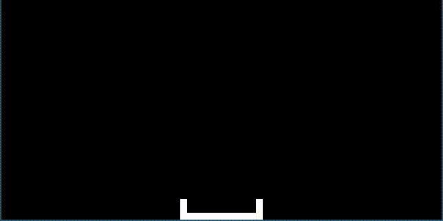

# CHIP-8 Emulator

A CHIP-8 virtual machine written from scratch in C++17, with an SDL3-based display and input layer. Built as a deep dive into emulator architecture, bitwise instruction decoding, and low-level systems programming.


## Demo



*Tetris (`tetris.ch8`) running in the emulator at 10x scale.*

## Overview

This is a fully functional interpreter for the CHIP-8 virtual machine, the classic 1970s interpreted language used to teach emulator development. It implements the complete standard instruction set, a 4KB addressable memory space, a 16-key hex keypad, and a 64×32 pixel display, and can load and run real CHIP-8 ROMs such as Tetris.

## Features

- **Complete CHIP-8 instruction set**: all 34 standard opcodes: control flow (jumps, calls, subroutines), conditional skips, arithmetic and bitwise register operations, memory/index operations, BCD conversion, sprite drawing with collision detection, keyboard input, and timers.
- **SDL3 rendering & input**: a 64×32 monochrome display upscaled with nearest-neighbor filtering for crisp pixels at any window size, and a full 16-key hex keypad mapped to a standard QWERTY layout.
- **Configurable at launch**: window scale, CPU cycle delay (emulation speed), and ROM path are all passed as command-line arguments.
- **Self-contained build**: SDL3 headers and prebuilt libraries (x86, x64, arm64) are vendored directly in the repo, so building requires only a C++17 compiler.
- **Bundled ROMs**: `tetris.ch8` for a playable demo and `test.ch8` for manually verifying instruction correctness.

## Technical Highlights

- **Function-pointer dispatch tables.** Opcodes are decoded through a `masterTable` keyed by the top nibble, with secondary tables (`Table0`, `Table8`, `TableE`, `TableF`) resolving instruction families that share a leading nibble (e.g. all `0x8...` arithmetic ops). This avoids a large switch statement and mirrors how real CPUs use opcode/sub-opcode decoding.
- **Emulation core decoupled from rendering.** The `chip8` class (registers, memory, stack, timers, opcode execution) has no dependency on SDL, all windowing, texture streaming, and input polling live in a separate `app` class, keeping the CPU logic portable and isolated from presentation.
- **Accurate memory layout.** ROMs load at `0x200` and the built-in hexadecimal font set loads at `0x50`, matching the original COSMAC VIP conventions that CHIP-8 software expects.
- **Frame-independent timing.** The main loop uses `std::chrono::high_resolution_clock` to gate CPU cycles by an elapsed-time delta rather than a fixed frame count, keeping emulation speed consistent regardless of host performance.
- **Correct sprite XOR/collision semantics.** `Dxyn` draws sprites pixel-by-pixel with proper XOR blending against the framebuffer, sets `VF` on collision, and wraps at screen edges.

## Project Structure

```
emulator-chip8/
├── chip8.h / chip8.cpp    CPU core: registers, memory, stack, opcode tables & instructions
├── app.h / app.cpp        SDL3 window, renderer, texture, and keyboard input
├── main.cpp               Entry point, CLI parsing, and the timed emulation loop
├── build.bat              Windows build script (clang++, C++17)
├── run-chip8 .bat / test-chip8.bat   Launch scripts for the bundled ROMs
├── tetris.ch8 / test.ch8  Bundled CHIP-8 ROMs
├── SDL3/                  Vendored SDL3 headers
└── lib/                   Vendored SDL3 libraries (x86 / x64 / arm64)
```

## Build & Run

**Prerequisites:** Windows with `clang++` (LLVM) on your `PATH`, supporting C++17. SDL3 is vendored in the repo, so no separate library install is needed.

```bash
git clone https://github.com/kads1024/emulator-chip8.git
cd emulator-chip8
build.bat
```

Run with a window scale, cycle delay in milliseconds, and a ROM path:

```bash
main.exe <scale> <cycle-delay-ms> <rom-path>

# Example: Tetris at 10x scale
main.exe 10 3 tetris.ch8
```

Or use the bundled launch scripts:

```bash
run-chip8 .bat     # Tetris, 10x scale
test-chip8.bat     # Opcode test ROM, 10x scale
```

## Controls

The original COSMAC VIP hex keypad is mapped onto the left side of a QWERTY keyboard:

```
CHIP-8 Keypad           Keyboard
1 2 3 C                  1 2 3 4
4 5 6 D       -->        Q W E R
7 8 9 E                  A S D F
A 0 B F                  Z X C V
```

`Esc` exits the emulator.

## Learning Resources & Acknowledgments

This project was built to explore emulator architecture, bitwise instruction decoding, and low-level systems programming in C++. [Austin Morlan's CHIP-8 emulator article](https://austinmorlan.com/posts/chip8_emulator/) was a valuable reference while learning core concepts such as opcode dispatch tables and instruction decoding: it informed the *approach*, but every line of code in this repository, including the SDL3 rendering layer, timing loop, and instruction implementations, was written independently as part of this project.
